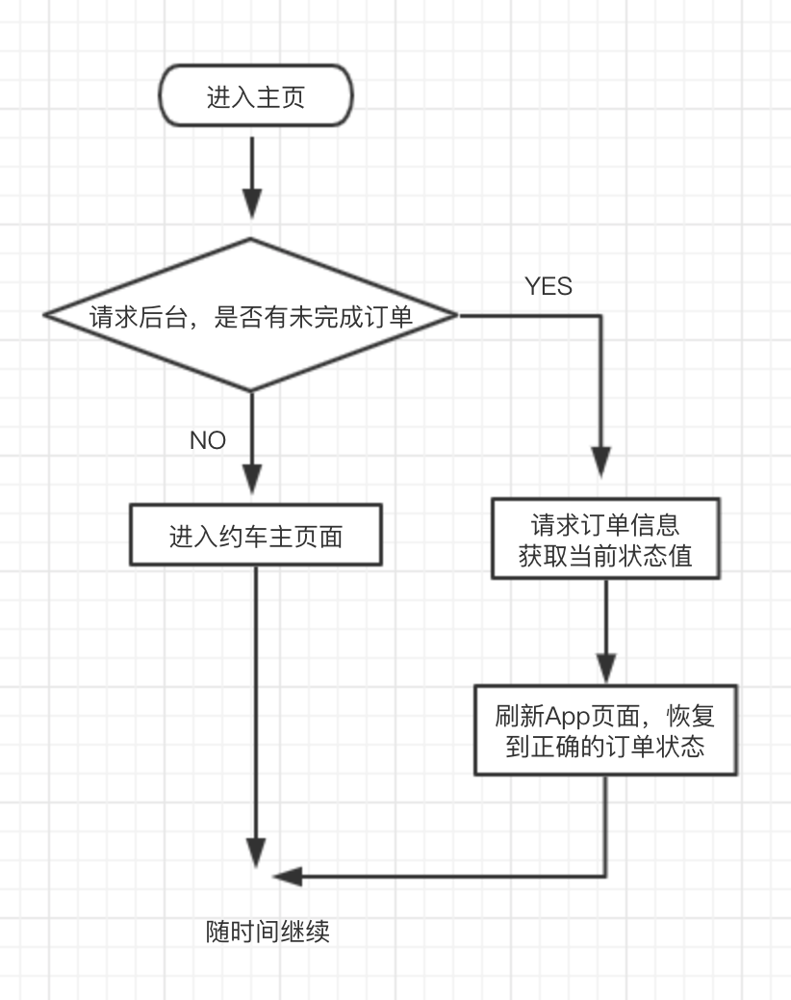

# 订单恢复逻辑

### 订单恢复适用场景

1. 用户账户下存在未完成订单，进入约车主页
2. 约车过程中杀死App，重新进入
3. 约车过程中进入后台，处理其他任务，稍后再次重新进入约车主页
4. **下预约订单后，等到订单开始，从预约成功页面返回约车主页面**
5. ...

订单恢复基础流程如图



为了适应以后更多的需求，额外提供接口控制是否需要服务订单，接口字段

```objectivec
@property(nonatomic , assign) BOOL shouldTryResumeOrder;
```


是否需要尝试恢复订单, 当退出约车主页设置为NO,进入约车主页前可以设置YES，即可尝试恢复订单

 **@note** 需在特定页面设置为yes，返回约车主页即可恢复订单

**目前需要恢复订单页面：后续根据需求新增加**

1. 从入口页面进入约车页面，设置为YES，每次进入需恢复订单【Push】
2. 首次进入，选择或者修改用户身份页面进入约车主页需恢复订单【Push】
3. 从预约订单回到约车页面，需要恢复订单，存在预约单已出发情况【Pop】
4. 从我的行程列表页面退回约车主页，存在此刻已经订单状态改变的情况【Pop】


**实际页面做法**

```objectivec
1. 每次在viewWillAppear 中都会根据 shouldTryResumeOrder 来判断进行恢复订单。
2. viewDidDisappear 都会设置 shouldTryResumeOrder = NO,

约车主页面需要在(Push/Pop)进入之前由外部页面进行设置 shouldTryResumeOrder，来确定需要恢复订单

Push 到主页面确定需要恢复订单
    1. XYChooseUserTypeViewController
2. FFTravelViewController
Pop 到约车主页确定需要恢复订单

    1. 预约成功页面（仅预约成功一种状态时候返回需要）
2. 我的行程页面
```


