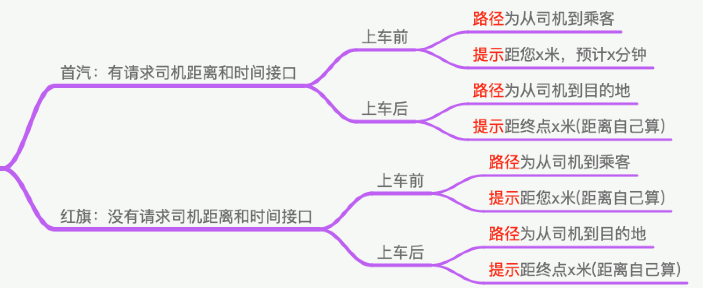

# 司机行驶轨迹展示逻辑

## 绘制司机行驶轨迹司机

司机轨迹绘制主要分两种情况

1. 接单后，乘客上车前 --&gt; 司机来接乘客
2. 乘客上车后，去往目的地 


 两个平台逻辑相同，但是红旗平台接口缺少，司机预估时间和距离字段，这里的展示相应也就不同


对应展示逻辑如图所示

### 地图SDK 和 对应的路径绘制

涉及到的地图SDK ，具体版本忘记了，以后更新的时候可以统一更新

1. AMapSearchKit.framework【用于POI，查询地图周围信息，编码等】
2. MAMapKit.framework【地图展示相关】
3. AMapFoundationKit.framework【地图框架基础】
4. AMapLocationKit.framework【定位相关】
5. AMapNaviKit.framework【导航相关，导航路径绘制】
6. AMapNavi.bundle【资源】
7. AMap.bundle【资源】

